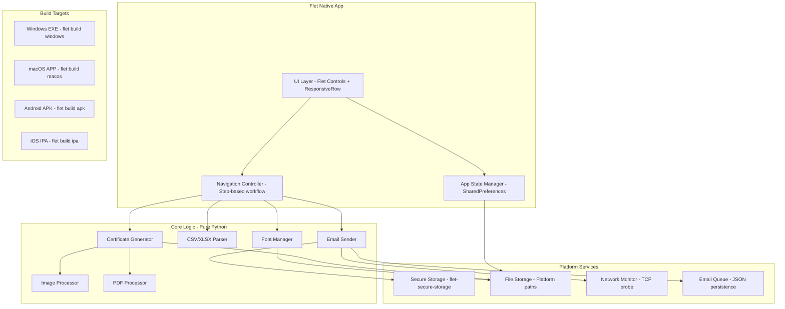

# Design Document: Offline Cross-Platform App

## Overview

This design converts CertFlow from a Streamlit-based web application into a fully offline-capable, cross-platform native application using Flet. The application will be packaged as standalone installers for Windows (EXE), macOS (APP), Android (APK), and iOS (IPA).

The core architectural shift is:
1. **Eliminate Streamlit dependency** from all `utils/` modules — they become pure Python libraries
2. **Replace credential loading** with Flet's `flet-secure-storage` (backed by platform-native Keychain/Keystore/DPAPI)
3. **Add network awareness** with an email queue that persists unsent messages for retry
4. **Bundle fonts selectively** — 5 core fonts shipped, additional fonts importable from device
5. **Use Flet's `ResponsiveRow`** and breakpoint-aware layouts for UI parity across screen sizes
6. **Leverage `flet build`** CLI for platform-specific packaging with embedded Python runtime

### Key Design Decisions

| Decision | Choice | Rationale |
|----------|--------|-----------|
| UI Framework | Flet (Flutter-backed) | Already partially adopted in `main.py`; `flet build` produces native packages for all 4 targets |
| Secure Storage | `flet-secure-storage` package | Wraps Flutter's `flutter_secure_storage` — uses iOS Keychain, Android Keystore, Windows Credential Manager, macOS Keychain natively |
| Persistent State | Flet `SharedPreferences` service | Cross-platform key-value store backed by native shared preferences |
| Email Queue | JSON file in app data directory | Simple, human-readable, survives restarts without database dependency |
| Font Strategy | 5 bundled + user-importable (max 20) | Reduces APK/IPA size from ~15MB fonts to ~2MB while preserving customizability |
| PDF Library | PyMuPDF (fitz) | Already in use; Flet provides pre-built binaries for Android/iOS via `flet build` |
| Network Detection | TCP probe to smtp.gmail.com:587 | Simple, reliable, no extra dependency; 5-second timeout |

## Architecture



### Layer Responsibilities

| Layer | Responsibility | Dependencies |
|-------|---------------|--------------|
| **UI Layer** | Render controls, handle user input, display previews/progress | Flet framework only |
| **App State Manager** | Persist/restore session settings, manage state transitions | `SharedPreferences` |
| **Core Logic** | Certificate generation, CSV parsing, email composition | Pillow, PyMuPDF, ReportLab, openpyxl (no Flet, no Streamlit) |
| **Platform Services** | Credential storage, file I/O, network detection, queue management | `flet-secure-storage`, platform APIs |

## Components and Interfaces

### 1. CredentialStore

Replaces the current `credentials.toml` / `st.secrets` approach with platform-native secure storage.

```python
class CredentialStore:
    """Platform-agnostic credential management using flet-secure-storage."""

    KEYS = ("certflow_email", "certflow_app_password")

    async def store(self, email: str, app_password: str) -> None:
        """Store credentials in platform secure storage."""

    async def load(self) -> Optional[GmailCredentials]:
        """Load credentials from secure storage, return None if not found."""

    async def clear(self) -> None:
        """Remove all stored credentials."""

    async def is_configured(self) -> bool:
        """Check if credentials exist in storage."""

    def validate_email(self, email: str) -> Optional[str]:
        """Validate email format (local-part@gmail.com). Returns error or None."""

    def validate_app_password(self, raw: str) -> Optional[str]:
        """Validate app password (16 alpha chars, spaces ignored). Returns error or None."""
```

**Fallback chain**: If `flet-secure-storage` raises a permission or availability error, fall back to encrypted `~/.certflow/credentials.toml`.

### 2. EmailQueueManager

New component that persists unsent emails for offline-to-online transitions.

```python
@dataclass
class QueuedEmail:
    id: str
    recipient_email: str
    attendee_name: str
    subject: str
    body: str
    certificate_data_b64: str  # base64-encoded attachment
    certificate_format: str
    retry_count: int = 0
    last_error: str = ""
    queued_at: str = ""  # ISO timestamp
    last_attempt_at: str = ""

class EmailQueueManager:
    """Manages persistent email queue with retry logic."""

    MAX_RETRIES = 3
    POLL_INTERVAL_SECONDS = 30

    async def enqueue(self, emails: List[QueuedEmail]) -> None:
        """Add emails to the persistent queue."""

    async def dequeue_pending(self) -> List[QueuedEmail]:
        """Get all emails with retry_count < MAX_RETRIES."""

    async def mark_sent(self, email_id: str) -> None:
        """Remove successfully sent email from queue."""

    async def mark_failed(self, email_id: str, error: str) -> None:
        """Increment retry count; if >= MAX_RETRIES, mark permanently failed."""

    async def get_status(self) -> QueueStatus:
        """Return counts: pending, permanently_failed, last_attempt timestamp."""

    async def get_permanently_failed(self) -> List[QueuedEmail]:
        """Return all emails that exhausted retries."""
```

### 3. NetworkMonitor

Simple connectivity checker — no background service, just on-demand probing with optional polling.

```python
class NetworkMonitor:
    """Check network connectivity via TCP probe to SMTP server."""

    SMTP_HOST = "smtp.gmail.com"
    SMTP_PORT = 587
    TIMEOUT_SECONDS = 5

    async def is_online(self) -> bool:
        """Attempt TCP connection to SMTP server. Returns True if reachable."""

    async def start_polling(self, callback: Callable[[bool], None]) -> None:
        """Poll every 30s and invoke callback on status change."""

    async def stop_polling(self) -> None:
        """Stop background polling."""
```

### 4. FontManager (Revised)

Replaces the current Google Fonts download approach with local-only font management.

```python
class FontManager:
    """Manages bundled and user-imported fonts."""

    BUNDLED_FONTS = ["Arial", "Roboto", "Montserrat", "PlayfairDisplay", "GreatVibes"]
    MAX_IMPORTED = 20
    MAX_FONT_SIZE_BYTES = 10 * 1024 * 1024  # 10 MB

    def get_available_fonts(self) -> List[FontInfo]:
        """List all fonts (bundled + imported) with metadata."""

    async def import_font(self, file_path: str, file_bytes: bytes) -> FontImportResult:
        """Validate and store an imported TTF font. Returns success/error."""

    async def remove_font(self, font_name: str) -> bool:
        """Remove an imported font. Bundled fonts cannot be removed."""

    def resolve_font_path(self, font_name: str) -> str:
        """Get absolute path for a font by name."""

    def validate_ttf(self, file_bytes: bytes) -> bool:
        """Check file is a valid TTF with at least one glyph table."""
```

### 5. PlatformStorage

Resolves platform-specific output directories and manages file I/O.

```python
class PlatformStorage:
    """Platform-aware file storage for generated certificates."""

    def get_output_directory(self) -> Path:
        """
        Returns platform-appropriate output directory:
        - Windows: ~/Documents/CertFlow/
        - macOS: ~/Documents/CertFlow/
        - Android: app external files directory
        - iOS: app Documents directory
        """

    def get_app_data_directory(self) -> Path:
        """
        Returns platform-appropriate app data directory:
        - Windows: %APPDATA%/CertFlow/
        - macOS: ~/Library/Application Support/CertFlow/
        - Android: app internal data
        - iOS: app data container
        """

    def sanitize_filename(self, name: str, extension: str) -> str:
        """
        Sanitize attendee name for filename:
        - Replace non-alphanumeric/non-space with underscore
        - Replace spaces with underscores
        - Truncate base to 200 chars
        - Append extension
        """

    def deduplicate_filename(self, filename: str, existing: Set[str]) -> str:
        """Append _2, _3, etc. if filename already exists in the set."""

    async def write_certificate(self, filename: str, data: bytes) -> Optional[str]:
        """Write cert to output dir. Returns None on success, error message on failure."""

    async def ensure_directory(self, path: Path) -> None:
        """Create directory tree if it doesn't exist."""
```

### 6. Revised EmailSender

The existing `EmailSender` class gets a new credential loading chain (no Streamlit):

```python
class EmailSender:
    """Gmail SMTP sender — Streamlit-free."""

    def __init__(self, credentials: Optional[GmailCredentials] = None) -> None: ...

    def load_credentials(self) -> GmailCredentials:
        """
        Credential fallback chain (no Streamlit):
        1. credentials.toml in app directory
        2. ~/.certflow/credentials.toml
        3. Environment variables (CERTFLOW_EMAIL_SENDER, CERTFLOW_EMAIL_APP_PASSWORD)
        Raises ConfigurationError listing all checked sources.
        """

    # send_bulk, connect, disconnect remain unchanged
```

### 7. AppStateManager

Wraps Flet `SharedPreferences` for session persistence.

```python
class AppStateManager:
    """Persist and restore application state across sessions."""

    KEYS = [
        "template_path", "template_format",
        "attendee_path",
        "font_family", "font_size", "font_color", "vertical_position",
        "email_subject", "email_body",
    ]

    async def save(self, key: str, value: str) -> None:
        """Save a setting to persistent storage."""

    async def load_all(self) -> Dict[str, Optional[str]]:
        """Load all persisted settings. Missing keys return None."""

    async def clear(self, key: str) -> None:
        """Clear a specific persisted key."""

    async def clear_all(self) -> None:
        """Reset all persisted state."""
```

## Data Models

### Existing Models (Unchanged)

- `AttendeeRecord(name: str, email: str)`
- `CertificateOutput(attendee_name: str, certificate: Image | bytes, format: str)`
- `BatchResult(certificates: List[CertificateOutput], errors: List[GenerationError])`
- `GmailCredentials(sender_email: str, app_password: str)`
- `EmailTemplate(subject: str, body: str)`
- `SendResult(successful: List[str], failures: List[DeliveryFailure])`

### New Models

```python
@dataclass
class QueuedEmail:
    """An email pending delivery in the offline queue."""
    id: str                    # UUID
    recipient_email: str
    attendee_name: str
    subject: str
    body: str
    certificate_data_b64: str  # Base64-encoded certificate bytes
    certificate_format: str    # "png", "jpg", "pdf"
    retry_count: int = 0
    last_error: str = ""
    queued_at: str = ""        # ISO 8601 timestamp
    last_attempt_at: str = ""  # ISO 8601 timestamp

@dataclass
class QueueStatus:
    """Current state of the email queue."""
    pending_count: int
    failed_count: int
    last_attempt: Optional[str]  # ISO 8601 or None

@dataclass
class FontInfo:
    """Metadata about an available font."""
    name: str
    filename: str
    path: str
    is_bundled: bool
    size_bytes: int

@dataclass
class FontImportResult:
    """Result of a font import operation."""
    success: bool
    font_name: str = ""
    error_message: str = ""

@dataclass
class PersistedState:
    """All settings restored from SharedPreferences on app launch."""
    template_path: Optional[str] = None
    template_format: Optional[str] = None
    attendee_path: Optional[str] = None
    font_family: str = "Arial"
    font_size: int = 40
    font_color: str = "#000000"
    vertical_position: int = 50
    email_subject: str = "Your Certificate of Achievement"
    email_body: str = "Hi {name},\n\nPlease find your certificate attached.\n\nBest regards,\nThe Team"
```

### Email Queue Persistence Format

The queue is stored as a JSON file at `{app_data_directory}/email_queue.json`:

```json
{
  "version": 1,
  "emails": [
    {
      "id": "550e8400-e29b-41d4-a716-446655440000",
      "recipient_email": "attendee@example.com",
      "attendee_name": "Jane Smith",
      "subject": "Your Certificate",
      "body": "Hi Jane Smith, ...",
      "certificate_data_b64": "iVBORw0KGgo...",
      "certificate_format": "png",
      "retry_count": 1,
      "last_error": "Connection timeout",
      "queued_at": "2024-01-15T10:30:00Z",
      "last_attempt_at": "2024-01-15T10:31:00Z"
    }
  ]
}
```


## Correctness Properties

*A property is a characteristic or behavior that should hold true across all valid executions of a system — essentially, a formal statement about what the system should do. Properties serve as the bridge between human-readable specifications and machine-verifiable correctness guarantees.*

### Property 1: Output format matches input format

*For any* valid template file (PNG, JPG, or PDF) and any valid attendee name, the generated certificate output format SHALL be identical to the input template format.

**Validates: Requirements 1.4**

### Property 2: Missing asset error message completeness

*For any* asset type (font or template) and any expected filename and storage location, when the asset is missing, the error message SHALL contain all three pieces of information: the asset type, the expected filename, and the expected storage location.

**Validates: Requirements 1.6**

### Property 3: Batch generation continues after overflow errors

*For any* batch of attendee names where some names exceed the template width, the system SHALL produce certificates for all non-overflowing names AND report errors for all overflowing names, with the total count of certificates plus errors equaling the original batch size.

**Validates: Requirements 1.8**

### Property 4: Filename sanitization correctness

*For any* string used as an attendee name and any valid file extension, the sanitized filename SHALL: (a) contain only alphanumeric characters and underscores, (b) have a base name of at most 200 characters before the extension, and (c) end with the correct extension.

**Validates: Requirements 2.6**

### Property 5: Filename deduplication guarantees uniqueness

*For any* list of attendee names processed in a single batch, after sanitization and deduplication, all resulting filenames SHALL be unique (no two filenames are identical).

**Validates: Requirements 2.7**

### Property 6: Credential validation correctness

*For any* string submitted as an email address, the validator SHALL accept it if and only if it matches the pattern `local-part@gmail.com`. *For any* string submitted as an app password, the validator SHALL accept it if and only if it contains exactly 16 alphabetic characters after all spaces are stripped.

**Validates: Requirements 3.6**

### Property 7: Offline queueing preserves entire batch

*For any* email batch of size N initiated while the network is unavailable, the email queue SHALL contain exactly N entries after the queueing operation, and the notification SHALL display the count N.

**Validates: Requirements 4.2**

### Property 8: Email queue serialization round-trip

*For any* list of valid QueuedEmail objects, serializing the queue to JSON and then deserializing it SHALL produce a list of QueuedEmail objects identical to the original (all fields preserved including id, retry_count, timestamps, and certificate data).

**Validates: Requirements 4.4**

### Property 9: Socket failure increments retry count

*For any* queued email with retry_count less than 3, when email delivery fails due to a socket error or connection timeout, the email's retry_count SHALL be incremented by exactly 1 and the email SHALL remain in the pending queue.

**Validates: Requirements 4.6**

### Property 10: Font import validation

*For any* file submitted for font import, the FontManager SHALL accept it if and only if: (a) the file extension is `.ttf`, (b) the file size is at most 10 MB, and (c) the file content is a valid TrueType font with at least one glyph table present.

**Validates: Requirements 5.2, 5.5**

### Property 11: Responsive layout threshold

*For any* screen width value, the application SHALL render a single-column layout when the width is below 600 logical pixels and a multi-column layout when the width is 600 logical pixels or above.

**Validates: Requirements 7.7, 9.6, 11.11**

### Property 12: Single certificate edit isolation

*For any* batch of generated certificates and any single edit operation on certificate at index I, all certificates at indices other than I SHALL remain byte-identical to their pre-edit state.

**Validates: Requirements 11.7**

### Property 13: ZIP archive completeness

*For any* batch of N generated certificates, the ZIP archive produced SHALL contain exactly N files, where each file's name corresponds to the sanitized attendee name with the correct format extension, and each file's content matches the generated certificate data.

**Validates: Requirements 11.8**

### Property 14: Settings persistence round-trip

*For any* combination of valid settings (font family from available fonts, font size 10-120, hex color string, vertical position 0-100, arbitrary subject string, arbitrary body string), persisting all settings and then loading them back SHALL produce values identical to the originals.

**Validates: Requirements 12.2, 12.3, 12.4, 12.5**

## Error Handling

### Error Categories and Responses

| Category | Trigger | Response | Recovery |
|----------|---------|----------|----------|
| **Template Load** | Corrupted file, unsupported format, missing file | Display error with asset type + filename + location | User uploads different file |
| **CSV Parse** | Bad encoding, missing columns, invalid rows | Display row-specific errors, skip invalid rows | User fixes file and re-uploads |
| **Text Overflow** | Name too long for template width | Report per-attendee error, continue batch | User edits name or adjusts font size |
| **Font Load** | Invalid TTF, file too large, max imports reached | Reject import with specific error message | User selects different font file |
| **Credential Validation** | Invalid email format, wrong password length | Field-specific error on setup screen | User corrects input |
| **SMTP Auth Failure** | Wrong app password | Show setup screen with email pre-filled | User enters correct password |
| **Network Unavailable** | TCP probe timeout (5s) | Queue all emails, show queued count | Auto-retry when online |
| **Email Delivery Failure** | Socket error during send | Increment retry, requeue (max 3 attempts) | Auto-retry on next poll cycle |
| **Permanently Failed Email** | 3 retries exhausted | Mark failed, show in queue status with reason | User can view failed list |
| **File Write Failure** | Permission denied, disk full | Log failure for that attendee, continue batch | User frees space or fixes permissions |
| **Secure Storage Unavailable** | Permission denied, missing service | Fall back to encrypted credentials.toml | Transparent to user |
| **Corrupted Persisted State** | Unreadable JSON, missing keys | Start with defaults, no error shown | Silent recovery |
| **Stale File Path** | Persisted path references deleted file | Notify user, clear that path from state | User re-uploads file |

### Error Propagation Strategy

1. **Core logic errors** (in `utils/`) raise specific exceptions (`TemplateLoadError`, `TextOverflowError`, `ConfigurationError`, etc.)
2. **UI layer** catches these exceptions and converts them to user-friendly notifications via `page.snack_bar` or inline error text
3. **Batch operations** never halt the entire batch on single-item failures — they collect errors and continue
4. **Background operations** (queue polling) log errors and retry silently without user interruption

## Testing Strategy

### Testing Framework

- **Unit tests**: pytest (existing framework)
- **Property-based tests**: hypothesis (already in project standards)
- **Mocking**: `unittest.mock` for platform services, network, and filesystem

### Property-Based Testing Configuration

- Library: [hypothesis](https://hypothesis.readthedocs.io/)
- Minimum iterations: 100 per property test
- Each property test references its design document property via tag comment
- Tag format: `# Feature: offline-cross-platform-app, Property {number}: {title}`

### Test Organization

```
tests/
├── test_certificate_generator.py   # Existing + Property 1, 3
├── test_csv_parser.py              # Existing (unchanged)
├── test_email_sender.py            # Existing + credential fallback tests
├── test_image_processor.py         # Existing (unchanged)
├── test_platform_storage.py        # NEW: Property 4, 5
├── test_credential_store.py        # NEW: Property 6
├── test_email_queue.py             # NEW: Property 7, 8, 9
├── test_font_manager.py            # NEW: Property 10
├── test_app_state.py               # NEW: Property 14
├── test_responsive_layout.py       # NEW: Property 11
├── test_zip_generation.py          # NEW: Property 13
└── test_batch_edit.py              # NEW: Property 12
```

### Property Test Mapping

| Property | Test File | Strategy |
|----------|-----------|----------|
| 1: Format preservation | `test_certificate_generator.py` | Generate random format choice + name, verify output format matches |
| 2: Error completeness | `test_certificate_generator.py` | Generate random asset metadata, trigger missing path, verify error fields |
| 3: Batch continuation | `test_certificate_generator.py` | Generate mix of short/long names, verify counts |
| 4: Filename sanitization | `test_platform_storage.py` | Generate random Unicode strings, verify sanitized output rules |
| 5: Filename uniqueness | `test_platform_storage.py` | Generate lists with intentional duplicates, verify all unique |
| 6: Credential validation | `test_credential_store.py` | Generate random strings, verify accept/reject matches rules |
| 7: Queue completeness | `test_email_queue.py` | Generate random batch sizes, mock offline, verify queue count |
| 8: Queue round-trip | `test_email_queue.py` | Generate random QueuedEmail lists, serialize/deserialize, verify equality |
| 9: Retry increment | `test_email_queue.py` | Generate emails with various retry counts, fail them, verify increment |
| 10: Font validation | `test_font_manager.py` | Generate random bytes + valid TTF bytes, verify accept/reject |
| 11: Layout threshold | `test_responsive_layout.py` | Generate random widths, verify column count matches threshold |
| 12: Edit isolation | `test_batch_edit.py` | Generate batch, edit random index, verify others unchanged |
| 13: ZIP completeness | `test_zip_generation.py` | Generate random batches, create ZIP, verify contents match |
| 14: Settings round-trip | `test_app_state.py` | Generate random valid settings, persist/load, verify equality |

### Unit Test Coverage (Example-Based)

- Platform path resolution (Req 2.1-2.4): one test per platform
- Credential fallback chain (Req 10.2): test each source in isolation and combined
- Queue status display (Req 4.5): set known state, verify status output
- Font bundling (Req 5.1): verify 5 default fonts exist
- Build configuration (Req 6-9): verify pyproject.toml settings are correct

### Integration Tests

- End-to-end certificate generation with real templates and font files
- SMTP connection and send with mocked SMTP server (CI-safe)
- Platform-specific secure storage read/write (per-platform CI runners)
- Flet build output verification (size, metadata, dependencies)

### What Is NOT Property-Tested

- Build pipeline outputs (Req 6-9): smoke tests only — `flet build` either works or doesn't
- Platform-specific secure storage backends: integration tests on each platform
- UI rendering and visual layout: manual testing + screenshot comparison
- Network polling timing (30s interval): integration test with mocked timer
- Preview rendering speed (less than 2s): performance benchmark, not a correctness property
